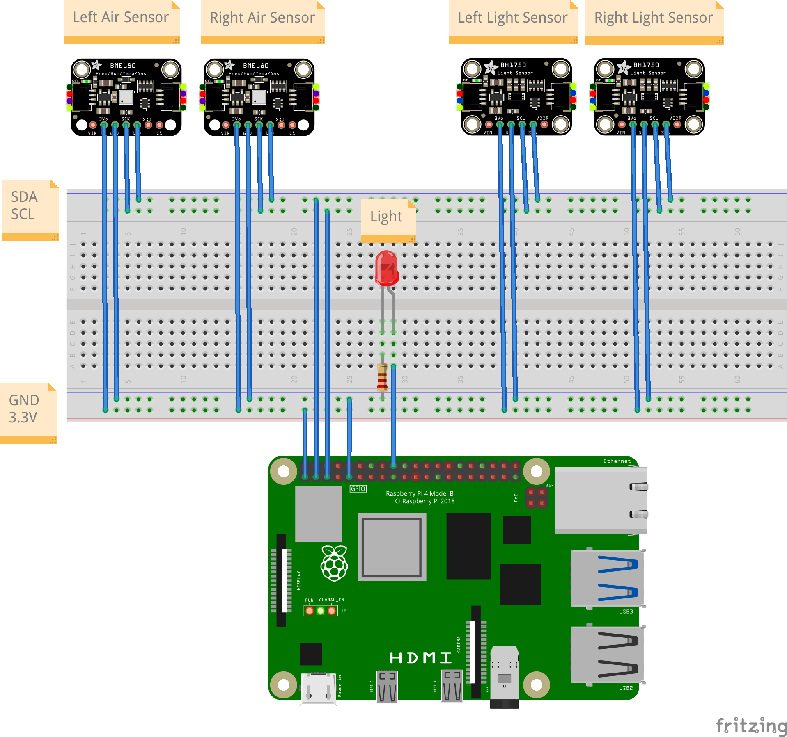
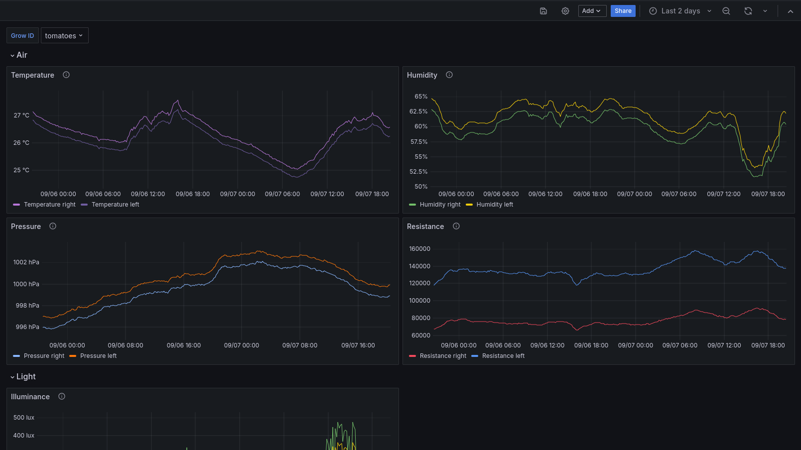

# Grow

Highly configurable software that helps you to control and monitor the environment of your plants.
It is focused on indoor use, but can also be used outdoors or in mixed scenarios.

Some people become perfectionists when growing plants and want to get the most out of it. It can be
very difficult to understand in hindsight why your chili peppers grew last year so much better than
this year. Why can't you get your tomatoes to grow properly and what is it they're missing? These
questions cannot be answered easily without being able to compare current data with archived data
that is known to have produced good results or with recommended conditions. When you know what your
plants need, you can make sure they have the best environmental conditions to grow via automated
control.

## Features

- Measurement of environmental data through sensors
- Structured storage of measurements in local databases
- Easy integration with monitoring and visualization tools, e.g. [Grafana](https://grafana.com)
- Control of various actuators via GPIOs
- Highly configurable for different use cases
- Easy installation and maintenance with the help of [Nix](https://nixos.org/)

## Installation

Typically this project runs on a device that is close your plants, for example a Raspberry Pi or
similar. Everything is tested and known to work on a Raspberry Pi 4 Model B, but you could also run
it on other devices. The only requirements are access to the Linux I2C Device interface if you want
to use sensors and a GPIO character device if you want to control GPIOs.

This project mainly consists of two components:

- **Agent**: The heart of this project. It measures the sensors, controls the GPIOs and stores
  measurements in databases. The configuration gives you fine grained control over everything, you
  can set different parameters and disable parts that don't fit your use case.

- **Server**: Provides a simple HTTP API to get measurements. Offers basic filtering and provides
  the data in a format that can be consumed by Grafana dashboards.

The [NixOS modules](./nix/modules/default.nix) provide a very convenient way to install and
configure everything together with a pre-provisioned Grafana instance. If you don't have Nix
installed already, check out the
[Determinate Nix Installer](https://determinate.systems/posts/determinate-nix-installer/), it boils
down to one command. Check out the [Nix Raspberry Pi SD image example](./examples/nix-rpi-sd-image)
to build a ready-to-run image for a Raspberry Pi 4 that you can flash on an SD card and plug into
your Pi. No further configuration is needed. Examples for installation on other operating systems,
e.g. [Raspberry Pi OS](https://www.raspberrypi.com/software/) will follow.

## How it works

Let's assume we have
[BME680](https://www.bosch-sensortec.com/media/boschsensortec/downloads/datasheets/bst-bme680-ds001.pdf)
gas/air sensors and [BH1750FVI](https://www.mouser.com/datasheet/2/348/bh1750fvi-e-186247.pdf) light
sensors connected to a Raspberry Pi 4 via I2C. Additionally, the Raspberry controls a light through
[GPIO 24](https://pinout.xyz/pinout/pin18_gpio24/), which is represented by an LED. In a real world
setup the GPIO would probably trigger a relais with a plant lamp.



The agent configuration only needs to mention the available items, things not listed in the config
are disabled by default. Assuming that the air sensors have the addresses `0x76` and `0x77` while
the light sensor addresses are `0x23` and `0x5C`, the minimal agent Nix configuration would look as
follows.

```nix
{
  grow.agent.config = {
    air.sample = {
      sample_rate_secs = 600;
      sensors = {
        left = {
          model = "Bme680";
          address = "0x77";
        };
        right = {
          model = "Bme680";
          address = "0x76";
        };
      };
    };

    light = {
      control = {
        mode = "TimeBased";
        pin = 24;
        activate_time = "10:00:00";
        deactivate_time = "22:00:00";
      };
      sample = {
        sample_rate_secs = 1200;
        sensors = {
          left = {
            model = "Bh1750Fvi";
            address = "0x23";
          };
          right = {
            model = "Bh1750Fvi";
            address = "0x5C";
          };
        };
      };
    };
  };
}
```

This will

- Measure with both air sensors every 10 minutes
- Measure with both light sensors every 20 minutes
- Activate GPIO 24 at 10:00:00 UTC and deactivate it at 22:00:00 UTC

See the [agent crate](./agent/) for more information.

Additionally, the [server crate](./server/) provides a HTTP API for the measurements which the
[Grafana Dashboard](./grow-dashboard.json) uses to display time series of the measurements.


